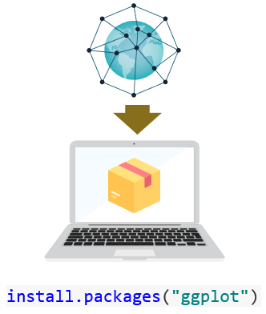

# Introducción a R

R es un lenguaje de programación diseñado para el análisis estadístico que goza de gran popularidad en el ámbito académico y comercial. Fue concebido como un software libre, lo que significa que su código puede ser manipulado y adaptado a las necesidades de los usuarios. Gracias a ello, su uso se ha extendido a otras áreas como la minería de texto, análisis espacial o el diseño de páginas web. Además, posee una gran versatilidad que le permite vincularse con otros programas como Python, Stata o Tableau.

Se puede trabajar en R de forma directa, sin embargo, es altamente recomendable usarlo a través de un entorno integrado de desarrollo (IDE, por sus siglas en inglés). Se trata de una herramienta que facilita la escritura y ejecución de código, la opción más utilizada es [RStudio](https://rstudio.com/forrester/), pero existen otras opciones como [Colaboratory](https://medium.com/@ezzaouia/how-to-use-r-and-python-with-google-colaboratory-notebook-ebc4774d48a) en donde se tiene acceso gratuito a GPU y es más fácil compartir el trabajo con otros usuarios.


## Instalación


El primer paso para instalar R es descargar el archivo ejecutable en la [página oficial](https://cran.itam.mx/) de acuerdo con el sistema operativo de la máquina. Después se descarga [Rstudio](https://rstudio.com/products/rstudio/download/) que es el entorno integrado de desarrollo. En la web existen diversos tutoriales que muestran paso a paso la instalación en [MAC](https://www.youtube.com/watch?v=sXMiwC9magQ), [Windows](https://www.youtube.com/watch?v=rxsE3Uc_bnU) o [Linux](https://www.youtube.com/watch?v=3ni-jP2qEWg).

Una vez finalizada la instalación, estamos listos para empezar a trabajar con R vía Rstudio.


```{r, out.width='40%', fig.align='center', echo=FALSE}
knitr::include_graphics('www/g0.PNG')
```


## Lógica de R

Para utilizar R, el primer paso siempre será **descargar los paquetes** usando el comando `install.packages(" ")`, los cuales contienen funciones que permiten realizar tareas específicas. Estos paquetes pueden obtenerse desde un repositorio oficial, como *CRAN*, conocido por su confiabilidad y rigurosa revisión de los contenidos, o desde plataformas alternativas como *GitHub*, donde los desarrolladores comparten su código.


```{r, out.width='30%', fig.align='center', echo=FALSE}

```

<br>